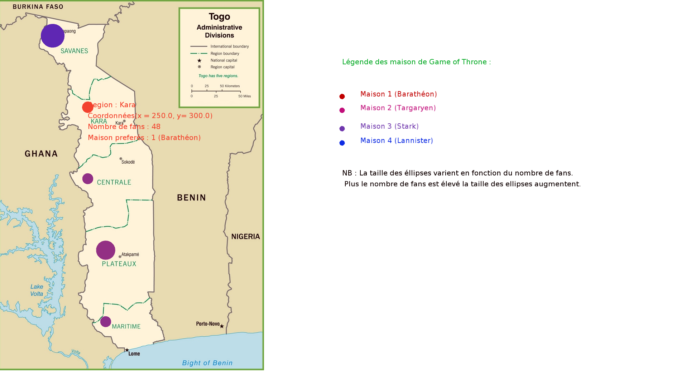

# TP Dataviz Carte Game of Throne

- Année : M1 iWOCS
- Matière: Dataviz

## Auteur(s)

|Nom|Prénom|login|email|
|--|--|--|--|
| *KOUTO* | *Dosseh* | *dosseh* | *dossehkouto@yahoo.fr* |

## Travail à réaliser

 On désire réaliser une visualisation interactive et dynamique de deux jeux de données sur une carte.

Le premier jeu de donnée indique le nombre de fans de Game of Thrones dans chaque région. Le second jeu de donnée fournit un chiffre entre 1 et 4 indiquant quelle maison est préférée majoritairement par les fans de cette région (1 Barathéon, 2 Targaryen, 3 Stark, 4 Lannister).

Trouvez la carte d'un pays de votre choix (autre que les États-Unis) divisée en régions. Créez un fichier fans.tsv indiquant pour chaque région le nombre de fans de GoT. Créez un autre fichier maisons.tsv indiquant pour chaque région la maison majoritairement favorite des fans. Vous pouvez bien sûr remplir ces fichiers aléatoirement.

La visualisation doit indiquer visuellement pour chaque région les deux valeurs, nombre de fans, maison majoritaire, vous pouvez le faire avec la technique de votre choix (taille-couleur, taille-images, transparence-couleur, etc.).

La visualisation doit se mettre-à-jour avec des valeurs aléatoires lorsqu'on appuie sur une touche, et la mise-à-jour doit être progressive. Lorsqu'on passe la souris sur un point de donnée, des informations plus complètes (nombre de fans, maison) doivent apparaître.

Le cours se trouve ici : https://github.com/Ant01n3/dataviz/wiki/Cours2
####  Aperçue du rendu.
 

## 
### KOUTO Dosseh
### M1 IWOCS
### dosseh.kouto@etu.univ-lehavre.fr
